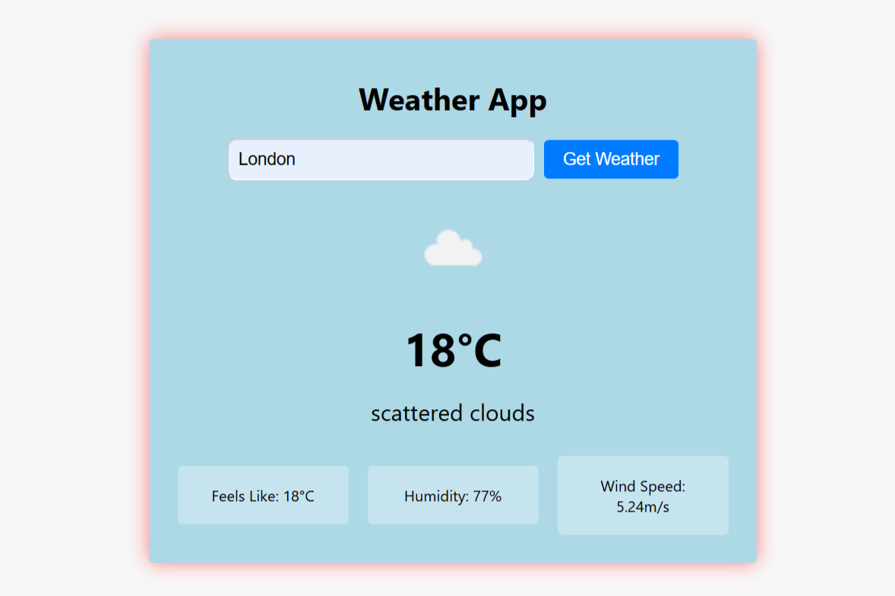

# 🌦 Weather App  

A simple **Weather App** built using **HTML, CSS, and JavaScript**.  
It fetches real-time weather data using the **OpenWeather API** and displays:  

- 🌡 Current Temperature  
- ☁️ Weather Condition (clouds, rain, etc.)  
- 💨 Wind Speed  
- 💧 Humidity  
- 🥶 Feels Like Temperature  

---

## 🚀 Features  

✔️ Search weather by city name  
✔️ Responsive and simple UI  
✔️ Real-time data from **OpenWeather API**  
✔️ Clean & minimal design  

---

## 🛠️ Tech Stack  

- **HTML5**  
- **CSS3**  
- **JavaScript (Fetch API)**  
- **OpenWeather API**  

---

## 📸 Screenshot  

---
